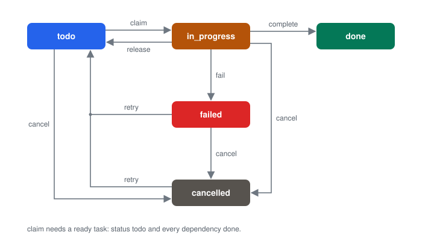
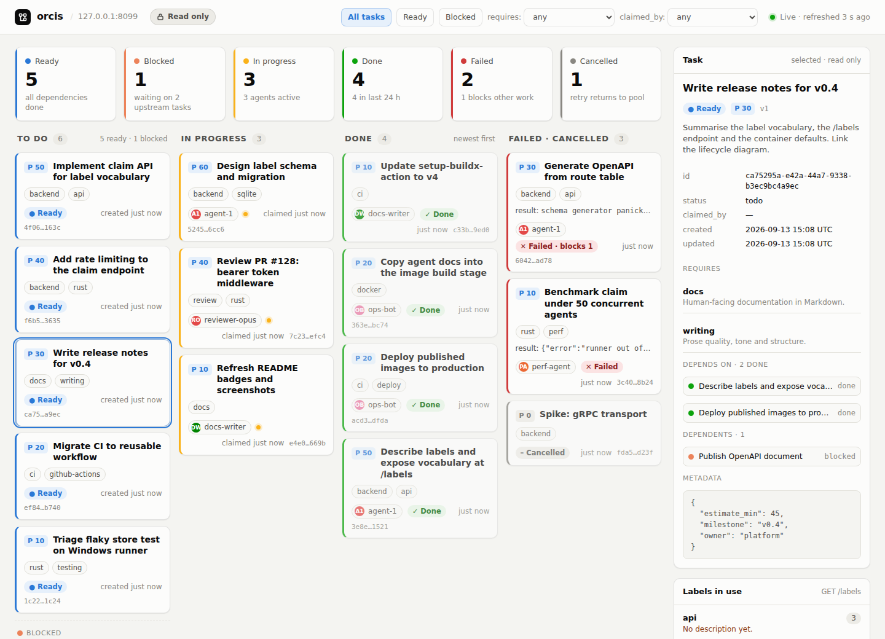

<div align="center">
<h1>orcis</h1>
<p>A JSON-over-HTTP task board and lightweight orchestrator for AI agents.</p>

[](https://nsg.github.io/aibadge/#mostly)
</div>

---

## About

orcis is a vibe-coded JSON-over-HTTP task board built exclusively for AI agents. It exposes an unordered pool of tasks with priorities, freeform capability requirements (`requires`), dependency edges (`depends_on`), and an atomic operation that gives an agent the best ready task it can perform.

Point an agent at `GET /docs.md` and it gets the complete agent-facing documentation as Markdown (the same text as [docs/agent.md](docs/agent.md)).

Run it as a single static binary configured through environment variables, and optionally protect the API with a bearer token. State lives in an embedded SQLite database (one file, no server to run). A read-only board for humans is served at `/ui`, while every mutation stays in the JSON API.

## Features

- Claim the highest-priority compatible task atomically.
- Self-maintaining label vocabulary: requirements carry descriptions, `GET /labels` lists what open tasks need, and labels vanish when their tasks close.
- Model dependency graphs and reject missing, self-referential, or cyclic edges.
- Filter tasks by status, readiness, requirements, and claiming agent.
- Enforce task-state transitions and ownership of active work.
- Attach arbitrary JSON metadata and completion or failure results.
- Persist the board in a single SQLite file with WAL and transactional claims.
- Discover every route through the JSON index at `GET /` and read the complete agent documentation at `GET /docs.md`.
- Watch the board in a browser at `/ui`: a read-only view that polls the API and never writes.

## How it works

Each task follows this lifecycle:

<p align="center">
  
</p>

A task is `ready` exactly when its status is `todo` and every task in `depends_on` is `done`. A `failed` or `cancelled` dependency keeps its dependents blocked until that dependency is retried and completed or the dependency edge is removed.

Agents read `GET /labels`, choose the labels that describe them, and claim with those names as their `capabilities`. Matching is exact by name, so the fuzzy judgement stays in the agent. Task authors reuse existing names and describe new ones.

Pool claims consider ready tasks whose requirement names are a subset of the agent's `capabilities`. They select the highest `priority`, then the oldest `created_at`, then the lowest UUID. Selection and transition to `in_progress` happen under one store lock, so two agents cannot claim the same task.

A typical agent loop is:

1. Poll `POST /tasks/claim` with the agent identifier and capabilities.
2. Treat `204 No Content` as no compatible ready work.
3. Perform the returned task when the response is `200 OK`.
4. Call `complete` with the same agent and an optional `result`.
5. Call `fail` with a result on terminal failure, or `release` to return unfinished work to the pool.

## Quick start

### Run from source

Start the server on its default address, `127.0.0.1:8080`:

```bash
cargo run
```

### Run the container

Run the published image with throwaway state. The database is written inside the container and discarded with it:

```bash
docker run --rm -p 8080:8080 ghcr.io/nsg/orcis:latest
```

Persist the board in a named volume. The container already defaults to `ORCIS_DB_PATH=/data/orcis.db`, so only the volume mount is needed:

```bash
docker run --rm -p 8080:8080 \
  -v orcis-data:/data \
  ghcr.io/nsg/orcis:latest
```

The mounted volume must be writable by uid `65534`, the non-root user in the image.

### Watch the board

Open `http://127.0.0.1:8080/ui`. The page polls the board every five seconds. When `ORCIS_TOKEN` is set, the page asks for the token once per browser session and keeps it in session storage.

<p align="center"></p>

### Exercise the dependency flow

With the server running, create task A, create task B that depends on A, then
claim from the pool. A comes out first even though B has the higher priority,
because B is blocked until A is done.

```bash
A=$(curl -sS http://127.0.0.1:8080/tasks \
  -H 'Content-Type: application/json' \
  -d '{"title":"Design schema","priority":10,"requires":[{"name":"backend","description":"Server-side code and data modelling."}]}' | jq -r .id)

curl -sS http://127.0.0.1:8080/tasks \
  -H 'Content-Type: application/json' \
  -d "{\"title\":\"Implement API\",\"priority\":20,\"requires\":[\"backend\"],\"depends_on\":[\"$A\"]}"

curl -sS http://127.0.0.1:8080/tasks/claim \
  -H 'Content-Type: application/json' \
  -d '{"agent":"agent-1","capabilities":["backend"]}'

curl -sS "http://127.0.0.1:8080/tasks/$A/complete" \
  -H 'Content-Type: application/json' \
  -d '{"agent":"agent-1","result":{"summary":"schema ready"}}'

curl -sS http://127.0.0.1:8080/tasks/claim \
  -H 'Content-Type: application/json' \
  -d '{"agent":"agent-1","capabilities":["backend"]}'
```

The second create shows B blocked by A:

```json
{
  "id": "b676295b-880d-44a8-b937-556cc6551c4e",
  "title": "Implement API",
  "status": "todo",
  "priority": 20,
  "requires": [{"name": "backend", "description": null}],
  "depends_on": ["93f6654d-db35-49ba-8030-caa595d70370"],
  "blocked_by": ["93f6654d-db35-49ba-8030-caa595d70370"],
  "dependents": [],
  "ready": false,
  "...": "remaining fields omitted"
}
```

The first claim returns A as `in_progress` with `claimed_by` set to `agent-1`.
After A is completed, the last claim returns B, now `in_progress` and no longer
blocked.

## Configuration

| Environment variable | Default | Meaning |
|---|---|---|
| `ORCIS_ADDR` | `127.0.0.1:8080` | Socket address on which to listen. The container overrides this with `0.0.0.0:8080`. |
| `ORCIS_DB_PATH` | `orcis.db` | SQLite database file; created on first start. SQLite's own `:memory:` name gives a throwaway board. |
| `ORCIS_TOKEN` | unset | Expected bearer token. Disable authentication when unset. |
| `RUST_LOG` | `info` | `tracing-subscriber` environment-filter directive. |

Every mutation is one SQLite transaction (`BEGIN IMMEDIATE`). The database uses WAL journal mode, and its schema is created and migrated automatically with `PRAGMA user_version`. Failure to open the database stops startup. A failed write returns `500 Internal Server Error` and leaves the board unchanged.

When `ORCIS_TOKEN` is set, send `Authorization: Bearer …` on every request except `GET /healthz`, `GET /docs.md`, and `GET /ui`. This includes the discovery index and other methods on those paths.

## API reference

All request bodies shown below use `Content-Type: application/json`. Successful task operations return the task object unless noted otherwise.

| Method | Path | Purpose | Success code |
|---|---|---|---|
| `GET` | `/` | Discover the service version and every endpoint. | `200` |
| `GET` | `/healthz` | Check service health without authentication. | `200` |
| `GET` | `/docs.md` | Read the agent documentation as Markdown without authentication. | `200` |
| `GET` | `/ui` | View the board read-only in a browser. | `200` |
| `POST` | `/tasks` | Create a task. | `201` |
| `GET` | `/tasks` | List and filter tasks. | `200` |
| `GET` | `/tasks/{id}` | Get one task. | `200` |
| `PATCH` | `/tasks/{id}` | Replace selected task fields. | `200` |
| `DELETE` | `/tasks/{id}` | Delete an unreferenced task. | `204` |
| `POST` | `/tasks/claim` | Claim the best compatible ready task. | `200` or `204` |
| `POST` | `/tasks/{id}/claim` | Claim a specific ready task. | `200` |
| `POST` | `/tasks/{id}/release` | Return owned work to `todo`. | `200` |
| `POST` | `/tasks/{id}/complete` | Mark owned work `done`. | `200` |
| `POST` | `/tasks/{id}/fail` | Mark owned work `failed`. | `200` |
| `POST` | `/tasks/{id}/cancel` | Cancel eligible work. | `200` |
| `POST` | `/tasks/{id}/retry` | Return failed or cancelled work to `todo`. | `200` |
| `GET` | `/labels` | List labels in use on open tasks. | `200` |
| `PUT` | `/labels/{name}` | Set a label description on open tasks. | `200` |

### Task object

Fields above the divider are stored. Fields below it are derived on every read and are never persisted.

```jsonc
{
  "id": "93f6654d-db35-49ba-8030-caa595d70370", // UUID v4; server-generated
  "title": "Design schema",
  "description": "",
  "status": "todo", // todo | in_progress | done | failed | cancelled
  "priority": 10,
  "requires": [{"name": "backend", "description": "Server-side code and data modelling."}],
  "depends_on": [],
  "metadata": {}, // any JSON value
  "claimed_by": null,
  "result": null, // any JSON value or null
  "created_at": "2026-09-11T08:03:30Z", // RFC 3339 UTC
  "updated_at": "2026-09-11T08:03:30Z",
  "version": 1,

  // Derived fields:
  "blocked_by": [], // dependencies whose status is not done
  "dependents": [], // tasks that contain this id in depends_on
  "ready": true
}
```

`version` starts at `1` and increments whenever that task is successfully mutated. `requires` and `depends_on` are deduplicated while preserving their first-seen order. Requirement matching uses the exact `name`; descriptions do not affect claims.

### Create a task

Send `POST /tasks` with:

```json
{
  "title": "Implement API",
  "description": "Add the task routes",
  "priority": 20,
  "requires": [
    {"name": "backend", "description": "Server-side code and data modelling."},
    "api"
  ],
  "depends_on": ["93f6654d-db35-49ba-8030-caa595d70370"],
  "metadata": {"owner": "platform"}
}
```

`title` is required, must contain a non-whitespace character, and is limited to 500 characters. `description` defaults to `""`, `priority` to `0`, `requires` and `depends_on` to `[]`, and `metadata` to `{}`. Each requirement may be a bare name or an object with `name` and optional `description`. Names are trimmed, must be nonempty, and are limited to 100 characters. Descriptions are trimmed, limited to 1000 characters, and stored as null when empty. Duplicate names preserve the first position and first non-null description. Every dependency must exist, a task cannot depend on itself, and the resulting graph cannot contain a cycle. Unknown fields are rejected. The response is `201 Created` with the new task.

### List and get tasks

Send `GET /tasks` with any combination of these filters. Different filters are ANDed.

| Query parameter | Semantics |
|---|---|
| `status` | Match any repeated value: `todo`, `in_progress`, `done`, `failed`, or `cancelled`. |
| `ready` | Match the derived readiness flag; accept only `true` or `false`. |
| `requires` | Require every repeated name to occur in the task's `requires` array. |
| `claimed_by` | Match the claiming agent exactly. |

Unknown query parameters are rejected. Results have this envelope:

```json
{"tasks": []}
```

Tasks are sorted by descending priority, ascending creation time, then ascending UUID. Send `GET /tasks/{id}` to retrieve one task. A malformed UUID is treated as not found.

### Patch a task

Send `PATCH /tasks/{id}` with any subset of the create-time fields:

```json
{"priority": 30, "requires": ["backend"], "metadata": null}
```

Each present field replaces the entire stored field; arrays and metadata are not merged. `requires` accepts the same bare names and objects, trimming, deduplication, and validation limits as creation. The same title and dependency validation applies as on creation. Explicit `null` is rejected for `title`, `description`, `priority`, `requires`, and `depends_on`; `metadata` accepts any JSON value, including `null`. Unknown fields are rejected.

### Delete a task

Send `DELETE /tasks/{id}`. Deletion returns `204 No Content`. If another task lists the target in `depends_on`, deletion returns `409 Conflict` and identifies the dependent UUIDs; remove those edges or delete the dependents first.

### Act on a task

| Endpoint | Body | Allowed transition and effects |
|---|---|---|
| `POST /tasks/{id}/claim` | Required `agent` string | Ready `todo` → `in_progress`; set `claimed_by`. Direct claims do not check capabilities. |
| `POST /tasks/{id}/release` | Required `agent` string | Owned `in_progress` → `todo`; clear `claimed_by`. |
| `POST /tasks/{id}/complete` | Required `agent`; optional `result` | Owned `in_progress` → `done`; store the optional result. |
| `POST /tasks/{id}/fail` | Required `agent`; optional `result` | Owned `in_progress` → `failed`; store the optional result. |
| `POST /tasks/{id}/cancel` | Empty object or no body | `todo`, `in_progress`, or `failed` → `cancelled`; clear `claimed_by`. |
| `POST /tasks/{id}/retry` | Empty object or no body | `failed` or `cancelled` → `todo`; clear `claimed_by` and `result`. |

Use these request body shapes for claim/release, complete/fail, and cancel/retry respectively:

```json
{"agent":"agent-1"}
```

```json
{"agent":"agent-1","result":{"summary":"done"}}
```

```json
{}
```

The claim, release, complete, and fail bodies require `agent`. Release, complete, and fail require that agent to match `claimed_by`; claim establishes ownership. Complete and fail retain `claimed_by`. An omitted `result` is stored as `null`. Invalid transitions and ownership mismatches return `409 Conflict`.

### Claim from the pool

Send `POST /tasks/claim`:

```json
{"agent":"agent-1","capabilities":["backend","cheap-ok"]}
```

`agent` is required and `capabilities` defaults to `[]`. The operation atomically claims the best ready task whose requirements are all present in the supplied capabilities. A task with no requirements matches every agent. The response is `200 OK` with the claimed task, or `204 No Content` with an empty body when nothing matches.

### Labels

Send `GET /labels` to list the vocabulary carried by open tasks (`todo`, `in_progress`, or `failed`), including how many open and ready tasks use each label:

```json
{"labels":[{"name":"backend","description":"Server-side code and data modelling.","open_tasks":2,"ready_tasks":1}]}
```

Labels carried only by `done` or `cancelled` tasks disappear. When open tasks carry different non-null descriptions, the most recently updated task wins, with the greatest task ID breaking timestamp ties.

Send `PUT /labels/{name}` to set the description on every open task carrying that exact name:

```json
{"description":"Server-side code and data modelling."}
```

The response is the updated label. A null or omitted `description` clears it. The description is trimmed and limited to 1000 characters; the path name must be nonempty and at most 100 characters. Closed tasks remain unchanged. If no open task carries the name, the response is `404 Not Found` with `{"error":"label not found"}`.

### Errors

Every API error is JSON with one field:

```json
{"error":"task not found"}
```

| Status | Produced when |
|---|---|
| `400 Bad Request` | JSON is malformed or has the wrong shape; a field, query, title, dependency, or UUID body value is invalid; or a request contains an unknown field. |
| `401 Unauthorized` | A configured bearer token is absent or incorrect. |
| `404 Not Found` | A route or task does not exist, or a task UUID in the path is malformed. |
| `405 Method Not Allowed` | A known route does not support the requested method. |
| `409 Conflict` | A transition, ownership, readiness, deletion, or dependency-cycle rule is violated. |
| `413 Payload Too Large` | A JSON request exceeds axum's 2 MiB default body limit. |
| `415 Unsupported Media Type` | A required or present JSON body does not have a JSON content type. |
| `500 Internal Server Error` | A database operation fails. The transaction is rolled back. |

Responses use `Content-Type: application/json` except successful `204 No Content` responses.

## Development

SQLite is compiled in through `rusqlite`'s `bundled` feature, so a C compiler is needed to build orcis.

Run the local checks:

```bash
cargo test
cargo clippy --all-targets -- -D warnings
cargo fmt
```

CI runs these checks on every push. Every push to `master` that touches more than Markdown also publishes the container image as `ghcr.io/nsg/orcis:latest` and `ghcr.io/nsg/orcis:sha-<commit>`.

## License

MIT
